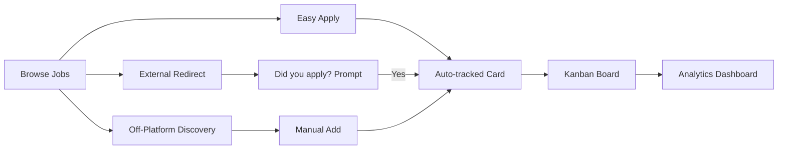

<div align="center">

# 📋 LinkedIn Application Tracker

### Closing LinkedIn's biggest job-search blind spot: the application that leaves the app.

*An Associate Product Manager case study — full PRD, research, personas, API design, and database schema for a native, first-party job-search workspace inside LinkedIn.*

[](./docs/case-study.md)
[](./docs/prd.md)
[](#)
[](./LICENSE)

</div>

---

## 🧩 The Problem

LinkedIn sends users to more job applications than any platform on earth — but it only reliably **tracks** the ones completed through Easy Apply. The moment a user clicks "Apply" and gets redirected to Workday, Greenhouse, Lever, or a company's own careers page, LinkedIn's job is done.

> **It opened a tab. It did not open a record.**

That gap pushes job seekers into spreadsheets, Notion boards, and third-party tools (Huntr, Teal, Simplify) just to answer a question LinkedIn itself should already know the answer to: *"What have I actually applied to, and where does it stand?"*

## 💡 The Solution

**LinkedIn Application Tracker** — a native workspace inside LinkedIn Jobs that:

| | |
|---|---|
| 🔁 **Auto-tracks everything** | Easy Apply *and* external redirects, via a lightweight one-tap "did you apply?" confirmation on tab return |
| ➕ **Manual add** | For jobs discovered entirely off-platform, so the whole search lives in one place |
| 🗂️ **Real workspace** | Kanban board, table view, calendar, reminders, and a funnel analytics dashboard — not a static list |
| 🔒 **Private by default** | Job searching is sensitive; tracker data never touches the public profile or network |

---

## 📁 Repository Structure

```
LinkedIn-Application-Tracker/
├── README.md                 ← you are here
├── LICENSE
└── docs/
    ├── case-study.md         ← problem framing, research, personas, strategy, vision
    └── prd.md                ← requirements, API design, DB schema, UI specs, launch plan
```

## 📖 Documents

### [`docs/case-study.md`](./docs/case-study.md) — Case Study
The narrative and strategic thinking behind the product decision:
- Executive summary & opportunity sizing
- Background research & synthesized pain points
- User interviews (representative)
- 4 user personas (job seekers + recruiter)
- Competitive analysis vs. Huntr, Teal, Simplify, Notion, and DIY spreadsheets
- Product goals, vision statement, user journey & flow diagram
- Key UX decisions and final recommendation

### [`docs/prd.md`](./docs/prd.md) — Product Requirements Document
The build-ready specification for engineering and design:
- North Star metric, primary/secondary KPIs, guardrail metrics
- Information architecture & feature prioritization (MoSCoW + RICE)
- MVP scope and phased roadmap
- 18 functional requirements · 7 non-functional requirements
- 33 edge cases
- 40 user stories with acceptance criteria
- Full REST API design (9 endpoints, request/response schemas)
- Database schema with entity-relationship diagram
- Screen-by-screen UI spec, wireframes, and hi-fi design tokens
- A/B testing plan, risk register, and launch strategy (Alpha → Beta → GA)

---

## 🔑 Key Product Decisions

- **North Star Metric:** *Weekly Tracked Applications per Active Job Seeker* — combines Easy Apply, confirmed-external, and manual entries into one adoption + habit signal.
- **MVP is deliberately narrow:** the confirmation prompt and Kanban board ship first because they solve the core tracking gap with existing infrastructure — no new ATS integrations required.
- **Privacy is the trust unlock:** tracker data is private by default, which is the precondition for honest, complete logging from passively job-searching (and currently employed) users.
- **AI features are explicitly deferred:** resume feedback, auto follow-ups, and email-based status detection are V2+ — the priority is a reliable data layer before adding intelligence on top of it.

---

## 🗺️ System Overview



*(Full user flow, ER diagram, and API contracts are in [`docs/prd.md`](./docs/prd.md).)*

---

## 🛠️ About This Project

This repository is a **portfolio case study**, written as an Associate Product Manager interview exercise. It is not an official LinkedIn product and is not affiliated with LinkedIn Corporation. All research, personas, and metrics are illustrative, prepared to demonstrate end-to-end product thinking — from problem discovery through PRD, API design, and launch planning.

**Author:** Navya Singh

## 📄 License

Released under the [MIT License](./LICENSE) — feel free to fork, adapt, or reference this for your own PM portfolio work.
