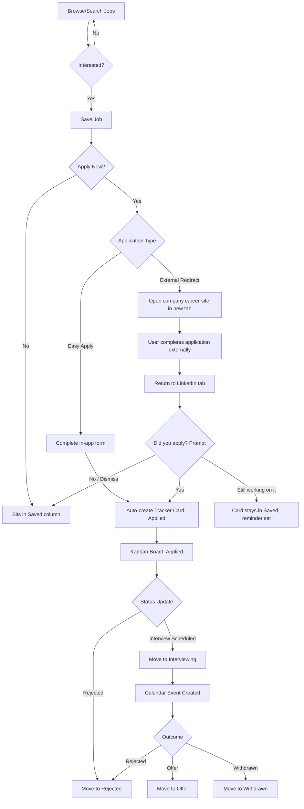

# LinkedIn Application Tracker
### A Product Management Case Study
**Prepared as an Associate Product Manager interview case study**
**Author:** Navya Singh | Product Case Study Portfolio

---

## 1. Executive Summary

### Problem Statement
LinkedIn is the largest professional job-search surface in the world, but it has a structural blind spot: **it only reliably tracks applications submitted through Easy Apply.** The moment a user clicks "Apply" on a job that routes to an external Applicant Tracking System (ATS) — Workday, Greenhouse, Lever, a company's own careers page — LinkedIn's job is done. It opened a tab. It did not open a record.

This is not a minor edge case. Easy Apply is a minority of postings on LinkedIn for mid-to-senior and many technical roles; the majority of serious job postings — especially at large tech companies, enterprises, and startups with their own ATS — redirect out. For those, LinkedIn shows the job as "viewed" or, at best, logs a soft "Applied" tag if the user re-confirms it, but there is no structured record of *when* the user applied, *what version of their resume* they used, *what stage* the application is in, or *what happened next*. The user is left maintaining that information themselves, usually in a spreadsheet, a notes app, or nowhere at all.

Compounding this, LinkedIn's own web UI for the "My Jobs" / "Applied Jobs" section is not built for active job-search management. It is a passive list, not a workspace. There is no Kanban view, no status pipeline, no reminders, no analytics on response rates, and no way to reconcile external applications with the job posting they came from.

### Proposed Solution
**LinkedIn Application Tracker**: a first-party, centralized job-search workspace inside LinkedIn that:
1. Automatically detects and logs *every* application initiated from a LinkedIn job posting — whether completed via Easy Apply or via an external redirect — using a lightweight "did you apply?" confirmation pattern triggered on tab return, plus manual entry for jobs found outside LinkedIn entirely.
2. Gives every application a persistent, structured record: company, role, source (Easy Apply vs. External vs. Manual), resume version used, status, notes, key dates, and next steps.
3. Replaces the current flat, static list with a real workspace: Kanban board, calendar view, reminders, and a search-funnel analytics dashboard.

### Expected Impact
- Close LinkedIn's largest job-seeker trust gap: users currently leave LinkedIn's own tracking system and use Notion, Huntr, Teal, or spreadsheets for the exact job LinkedIn should own — the application itself.
- Increase job-seeker session frequency and time-on-platform, since a maintained tracker pulls users back to check status and log updates.
- Increase completed-application rate for external-redirect jobs by making the outbound click feel "tracked" rather than "lost," which reduces the psychological friction of applying to jobs that require leaving the app.
- Strengthen LinkedIn's data moat on real application-outcome data (not just posting and view data), which improves Recruiter-side insights and can eventually feed better job-matching models.

---

## 2. Background Research

### Current LinkedIn Job Application Experience
Today, a user's applications appear in **Jobs → My Jobs → Applied**. This list shows job title, company, and applied date for Easy Apply jobs with reasonable accuracy. For external applications, the picture is much weaker:
- Clicking "Apply" on an external job opens the company's career site in a new tab. LinkedIn shows a one-time prompt ("Save this job to track it") but does not confirm whether the user actually completed the application, and does not capture any data from the external ATS (naturally — LinkedIn has no visibility into a third-party Workday instance).
- If the user doesn't manually mark the job as applied, it silently falls back into "Saved" or disappears from view entirely once dismissed.
- There is no way to distinguish, after the fact, "I clicked apply and finished it on their site" from "I clicked apply, got distracted, and never finished."

### Pain Points (Synthesized)
| Pain Point | Description |
|---|---|
| Silent data loss | External applications aren't tracked with any reliability, so weeks later the user can't recall if they applied to a role they're now being asked about in a screening call. |
| No single source of truth | Users maintain parallel spreadsheets or Notion boards duplicating what LinkedIn should already know, since it originated the job link. |
| No pipeline visibility | There's no way to see "12 applied, 3 in interview, 1 offer" at a glance — job search feels like a black hole rather than a funnel. |
| No resume version tracking | Power users tailor 3–5 resume variants; LinkedIn has no concept of "which resume did I send to this job." |
| No reminders | Follow-ups ("it's been 2 weeks, should I check in?") are entirely on the user to track manually. |
| UI too passive | The Applied Jobs list is read-only — no drag-and-drop status changes, no notes field, no filtering by stage. |

### User Interviews (Representative, Assumed for Case Study Purposes)
- *College student, final year:* "I applied to like 40 internships this semester. Half went through LinkedIn's own form, half redirected to some company site. I genuinely don't remember which ones I finished applying to and which ones I abandoned halfway."
- *Recent graduate:* "I built a Google Sheet with columns for company, date, resume version, status. It's more useful than LinkedIn's own tracker, which is honestly just embarrassing for a company this size."
- *Experienced professional (passive-to-active searcher):* "The worst part is when a recruiter calls about a role and I have to scramble to remember if I even applied, and with what resume, because LinkedIn just shows 'Applied' with no other context."
- *Recruiter (secondary stakeholder):* "From our side we can see application volume, but we have no insight into whether candidates dropped off mid-application on our external ATS after clicking through from LinkedIn — that's a black box for us too."

### Market Trends
- Standalone job-tracker tools (Teal HQ, Huntr, Simplify) have grown specifically to fill this gap — a strong signal of unmet demand that LinkedIn, as the traffic *source* for most of these applications, is best positioned to solve natively.
- Browser extensions that auto-fill and auto-track applications (Simplify Copilot, Careerflow) are proliferating, indicating users want automation over manual logging.
- The broader "personal CRM" pattern (tracking relationships/pipelines in a structured, visual way) has become an expected UX pattern across knowledge work tools (Notion, Airtable, HubSpot-style boards), and job search is functionally a sales pipeline for one's own candidacy.

---

## 3. User Personas

### Persona 1 — Ananya, College Student (Final Year, Engineering)
- **Goals:** Land an internship or entry-level role before graduation; apply broadly and quickly.
- **Frustrations:** Applies to 30–50 roles across Easy Apply and external sites; loses track of which she's completed; no idea which resume version she sent where.
- **Needs:** Fast bulk visibility, simple status tags, minimal manual data entry.

### Persona 2 — Rohan, Recent Graduate (0–1 YOE)
- **Goals:** Convert applications into interviews; understand what's working in his search.
- **Frustrations:** No feedback loop — doesn't know his response rate, doesn't know if it's his resume or the market.
- **Needs:** Analytics on response/interview conversion; ability to compare resume versions' performance.

### Persona 3 — Meera, Experienced Professional (5–10 YOE, passive-to-active)
- **Goals:** Make a selective, high-quality move without disrupting her current job; keep the search organized and discreet.
- **Frustrations:** Juggling a search alongside a full-time job means she forgets follow-ups; doesn't want her activity broadcast; needs a private space, not just a public "Open to Work" flag.
- **Needs:** Calendar-integrated reminders, private notes, discreet tracking that doesn't touch her public profile.

### Persona 4 — Karan, Recruiter (Secondary Stakeholder)
- **Goals:** Understand candidate funnel health; reduce drop-off between LinkedIn apply-click and completed external application.
- **Frustrations:** No visibility into whether candidates who click "Apply" from LinkedIn actually finish on the company's ATS.
- **Needs:** Aggregate, anonymized funnel data (click-through → completion rate) to diagnose whether job posts or the external application flow itself are causing drop-off.

---

## 4. Problem Statement

**Primary Problem:** LinkedIn originates the majority of job applications in the world but retains structured visibility into only a fraction of them (Easy Apply), losing the rest to external ATS redirects with no reconciliation mechanism.

**Business Problem:** This gap pushes job seekers to third-party tools (Notion, Huntr, Teal, spreadsheets) for a core job-search workflow that should live inside LinkedIn, reducing platform stickiness, session frequency, and the richness of LinkedIn's own outcome data.

**User Problem:** Job seekers cannot answer, with confidence, "which jobs have I actually applied to, with what resume, and what's the status of each" — because half their applications leave LinkedIn's system entirely and are never recorded.

**Opportunity Size (Illustrative):** LinkedIn reports very large weekly application volume across its platform; even a conservative assumption that 50%+ of applications on non-Easy-Apply postings currently go untracked implies tens of millions of "invisible" application events monthly — each one a missed data point and a missed reason to return to the app.

---

## 5. Competitive Analysis

| Tool | Core Features | Strengths | Weaknesses | Opportunity for LinkedIn |
|---|---|---|---|---|
| **LinkedIn (current)** | Easy Apply tracking, static Applied list | Direct access to job source, largest job graph | No external-apply tracking, no Kanban/reminders/analytics | Owns the traffic source — best positioned to close the loop natively |
| **Simplify** | Browser extension auto-tracks applications across ATSs, autofill | Strong autofill, wide ATS coverage | Third-party extension, not integrated with the job discovery source | LinkedIn can replicate detection without needing a browser extension for LinkedIn-originated jobs |
| **Huntr** | Kanban board, browser extension, job-search CRM | Great visual pipeline UX | Manual entry-heavy for non-supported sites, separate subscription | LinkedIn can auto-populate the board from actual click data |
| **Notion trackers** | Fully customizable database templates | Maximum flexibility | 100% manual, no automation, no job-source integration | LinkedIn offers automation Notion structurally cannot |
| **Teal HQ** | Resume builder + tracker + browser extension | Resume-tailoring tightly coupled to tracking | Separate ecosystem from where jobs are discovered | LinkedIn can tie tracking directly to profile/resume data it already has |
| **Google Sheets (DIY)** | Fully manual | Free, familiar, flexible | Entirely manual, no reminders, no analytics, easy to abandon | Sets the low bar LinkedIn needs to beat by default, with zero setup cost |

**Takeaway:** Every competitor either (a) requires a separate extension/tool disconnected from where the job was actually found, or (b) is fully manual. LinkedIn is the only player with native visibility into the moment of the apply-click itself.

---

## 6. Product Goals

**User Goals**
- See every application — Easy Apply, external, and manually added — in one place.
- Understand pipeline health at a glance (applied → interviewing → offer).
- Reduce forgotten follow-ups.

**Business Goals**
- Increase weekly active usage among job seekers.
- Reduce job-seeker reliance on third-party tracking tools.
- Improve application-completion rate on external-redirect jobs.
- Generate structured outcome data (response rate, time-to-interview) that can improve job recommendations and Recruiter product insights.

**Success Goals**
- A meaningful share of active job seekers adopt the tracker within two quarters of launch.
- Measurable lift in external-application completion rate attributable to the "track my application" prompt.
- Net reduction in stated use of third-party tracker tools among surveyed LinkedIn Premium job-seeker users.

---

## 7. Product Vision

*"No application should ever disappear. Wherever you apply — inside LinkedIn or beyond it — LinkedIn should be the one place that remembers, organizes, and helps you follow through."*

---

## 8. User Journey

**1. Discover:** User browses or searches jobs in the LinkedIn Jobs feed, sees a role matching their filters.

**2. Save:** User bookmarks the role for later ("Save" icon) — this alone should now seed a lightweight tracker entry in a "Saved" column, not just a bookmark list.

**3. Apply:**
   - *Easy Apply path:* User completes the in-app application flow; a tracker card is created automatically with full metadata (resume used, date, questions answered).
   - *External path:* User clicks "Apply," is redirected to the company's career site in a new tab, completes the application there. On returning focus to the LinkedIn tab (or on next LinkedIn visit), a lightweight, dismissible prompt asks: *"Did you finish applying to [Role] at [Company]?"* with one-tap Yes/No/Still working on it. A "Yes" instantly creates a full tracker card.
   - *Off-platform discovery:* User finds a job entirely outside LinkedIn (company site directly, another board) and manually adds it via "+ Add Application," pasting a URL or entering details, so their full search lives in one place regardless of origin.

**4. Track:** The tracker card lives in the Kanban board under "Applied." User can add notes, set a follow-up reminder, tag the resume version used, and update status manually or via automated cues (e.g., a rejection email forwarded/detected triggers a status suggestion).

**5. Receive Interview:** User updates status to "Interviewing," optionally logs interview dates into the integrated calendar view, which can prompt reminders for prep.

**6. Offer:** User updates to "Offer," with the analytics dashboard now reflecting the full funnel (applied → interview → offer) and time-to-response metrics for that application.

---

## 9. User Flow (Mermaid)

---

## 10. UX Decisions

- **One-tap confirmation prompt instead of a form:** Minimizes friction at the exact moment external-application data would otherwise be lost — the entire premise of solving the tracking gap depends on this being nearly zero-effort for the user.
- **Private-by-default data:** Job searching is often sensitive, especially for currently-employed users; making tracker data invisible to the network by default builds the trust needed for honest, complete logging.
- **Kanban as primary view, table as secondary:** Visual pipeline status matches how job seekers already mentally model their search (a funnel), while the table view serves power users who want to sort/filter precisely.
- **Snapshotting job details at apply-time:** Prevents the common failure mode where a deleted or edited posting leaves the user's own historical record incomplete or confusing.
- **Capped, backing-off prompts:** Protects against notification fatigue, which is the single biggest risk to sustained adoption of any tracking nudge.

---

## 11. Final Recommendation

LinkedIn should build the Application Tracker because it closes the single most consequential gap in its own core product: it is the platform that sends users to the majority of jobs they apply for, yet it currently loses track of what happens after that click for anything outside Easy Apply. This is not a nice-to-have feature — it's LinkedIn failing to finish a job it already started. Every day this gap persists, job seekers are pushed toward Notion boards, spreadsheets, and third-party trackers to manage a process LinkedIn itself originated, and LinkedIn forfeits both the engagement and the outcome data that should belong to it.

The solution proposed here is deliberately scoped: a low-friction confirmation prompt to capture external applications, a manual-add path for full search coverage, and a genuinely usable Kanban-based workspace — not a sprawling AI reinvention of job search. It's buildable with existing infrastructure, respects user privacy by default, and directly targets the two problems raised at the outset: **the untracked external-application blind spot, and the passive, difficult-to-use current tracking UI.** Closing that gap turns LinkedIn from a job *board* into the job seeker's actual system of record — which is where the real, durable engagement lives.

---

*For the complete build specification — success metrics, functional/non-functional requirements, API design, database schema, UI screens, and launch plan — see the companion document: **[Product Requirements Document](./prd.md)**.*
