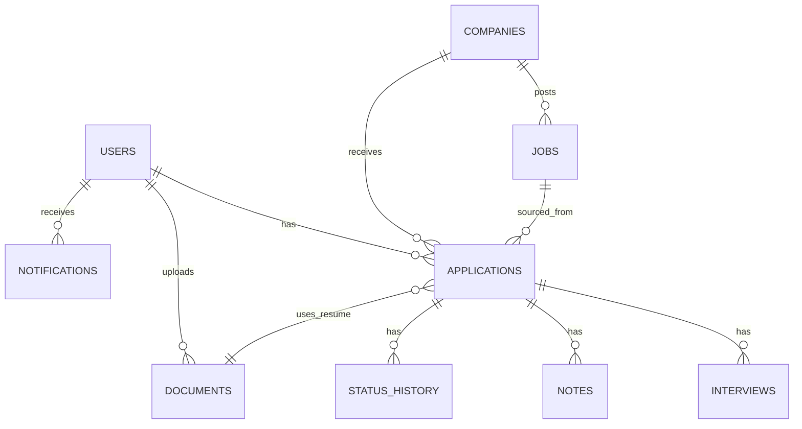

# LinkedIn Application Tracker
### Product Requirements Document (PRD)
**Author:** Navya Singh | Product Case Study Portfolio
**Companion document:** [LinkedIn Application Tracker — Case Study](./case-study.md) (problem framing, research, personas, competitive analysis, vision)

---

## 1. Product Overview

LinkedIn Application Tracker is a native workspace within LinkedIn Jobs that captures, organizes, and surfaces the full lifecycle of a user's job applications — regardless of whether they were completed via Easy Apply, an external company ATS, or added manually for jobs discovered off-platform.

**Objectives:** Close the external-application tracking gap; reduce reliance on third-party trackers; increase job-seeker engagement frequency; generate richer, first-party application-outcome data.

**Scope (V1):** Auto-tracking (Easy Apply + external confirmation), manual add, Kanban/table views, basic reminders, resume version tagging, private notes, CSV export, mobile parity.

**Dependencies:** Existing Easy Apply infrastructure; job posting metadata service; resume upload/storage service; notification service; mobile app parity team.

**Assumptions:** Users are willing to respond to a lightweight one-tap confirmation prompt without significant annoyance; most external applications are completed within one browsing session or shortly after.

**Out of Scope (V1):** Deep third-party ATS API integrations, AI email parsing for auto status detection, salary negotiation tooling, networking/referral recommendation engine.

---

## 2. Success Metrics

**North Star Metric:** Weekly Tracked Applications per Active Job Seeker (captures both adoption and habitual use — Easy Apply + confirmed external + manual entries, combined).

**Primary KPIs**
- External-application capture rate: % of external-redirect apply-clicks that get a confirmed tracked record (target: majority capture within two quarters, up from near-zero today).
- Weekly Active Trackers (WAT): unique users who view or update the tracker weekly.
- Application-to-interview conversion rate visibility adoption: % of tracker users who view their analytics tab at least monthly.

**Secondary KPIs**
- Resume-version attach rate on tracked applications.
- Reminder-driven follow-up action rate (did the user act on a nudge).
- Manual-add rate (jobs found off-LinkedIn, added manually) — signals broader search-hub adoption.

**Guardrail Metrics**
- No material regression in job-posting page load time due to the "did you apply?" confirmation prompt.
- No increase in user-reported annoyance/opt-out rate for post-redirect confirmation nudges (capped and monitored via feedback surveys).
- No degradation in Easy Apply completion rate.

---

## 3. Information Architecture

```
LinkedIn Jobs
└── Application Tracker (new top-level tab)
    ├── Dashboard (overview cards: total applied, active pipeline, upcoming interviews)
    ├── Applications
    │   ├── Kanban View (Saved / Applied / Interviewing / Offer / Rejected / Withdrawn)
    │   └── Table View (sortable, filterable list)
    ├── Calendar (interview dates, follow-up reminders)
    ├── Analytics (funnel conversion, response time, resume performance)
    ├── Notifications (reminders, external-apply confirmations, status nudges)
    └── Settings
        ├── Resume versions management
        ├── Reminder cadence preferences
        ├── Privacy (who can see "tracker active" status — private by default)
        └── Third-party export (CSV/Notion export for portability)
```

---

## 4. Feature Prioritization

### MoSCoW

| Feature | Priority |
|---|---|
| Auto-track Easy Apply | Must |
| Post-redirect "did you apply?" confirmation for external jobs | Must |
| Manual "+ Add Application" for off-LinkedIn jobs | Must |
| Kanban board with drag-and-drop status | Must |
| Basic reminders (follow-up nudges) | Should |
| Resume version tagging | Should |
| Calendar view with interview scheduling | Should |
| Analytics dashboard (funnel, response time) | Should |
| Notes per application | Should |
| AI-suggested status updates (e.g., detecting rejection language if user forwards email) | Could |
| Auto follow-up email drafting | Could |
| Salary/offer tracking with negotiation notes | Could |
| Full inbox integration for auto-status-detection | Won't (V1) |

### RICE Scoring (illustrative, 1–10 scale inputs)

| Feature | Reach | Impact | Confidence | Effort | RICE Score |
|---|---|---|---|---|---|
| External-apply confirmation prompt | 9 | 9 | 7 | 4 | ~14.2 |
| Kanban board | 8 | 8 | 8 | 5 | ~10.2 |
| Manual add | 7 | 6 | 9 | 2 | ~18.9 |
| Reminders | 6 | 7 | 7 | 3 | ~9.8 |
| Analytics dashboard | 6 | 6 | 6 | 5 | ~4.3 |
| Resume version tagging | 5 | 5 | 7 | 3 | ~5.8 |
| AI status detection | 4 | 6 | 4 | 8 | ~1.2 |

**Rationale:** The external-apply confirmation prompt and manual-add both score highest because they directly solve the stated core problem (untracked external applications) at relatively low engineering effort, since they don't require deep third-party ATS integration — just a client-side prompt and a manual entry form. Kanban is prioritized because it's the primary interface making the tracked data usable. AI-based automatic status detection is deprioritized to V2 due to high effort and lower confidence (email parsing is fragile and privacy-sensitive).

---

## 5. MVP Definition

**V1 (MVP) includes:**
- Auto-tracking of Easy Apply applications (already exists, extended with richer metadata).
- Post-redirect confirmation prompt for external applications.
- Manual "+ Add Application" entry.
- Kanban board + table view with basic statuses.
- Basic reminders (e.g., "no update in 14 days").
- Resume version tagging (manual selection from uploaded resumes).
- Privacy-first design: all tracker data is private by default, never shown on public profile.

**Deferred to V2+:**
- Calendar deep integration with external calendar apps (Google Calendar, Outlook sync).
- Full analytics dashboard with rejection-reason tagging.
- AI-assisted status detection from forwarded emails.
- Auto follow-up email drafting.
- Networking/referral recommendations tied to tracked companies.

**Rationale:** V1 focuses entirely on closing the tracking gap (the stated core problem) and making the resulting data usable in a basic pipeline view. Anything that adds intelligence on top of that data (analytics, AI detection) is deferred until there's a reliable, adopted data layer to build on.

**Acceptance Gate:** V1 general rollout requires the external-apply confirmation flow to reliably capture a majority of redirected applications in beta testing before general availability.

---

## 6. Functional Requirements

| Component | Requirement |
|---|---|
| **Dashboard** | Must show total active applications, count per stage, and upcoming reminders/interviews within 7 days. |
| **Application Cards** | Must display company logo, role title, source (Easy Apply/External/Manual), applied date, current status, resume version, and last-updated timestamp. |
| **Kanban Board** | Must support drag-and-drop between statuses; must persist column order; must support per-card quick actions (add note, set reminder). |
| **Calendar Reminders** | Must allow user to set a custom reminder date per application; must send an in-app + optional email notification. |
| **Interview Scheduler** | Must allow logging interview date/time/round/interviewer name (optional) per application; must sync to Calendar view. |
| **Application Timeline** | Must show a chronological log of status changes per application (Applied → Interviewing → Offer, with timestamps). |
| **Status Updates** | Must support manual status change via dropdown or drag-and-drop; must timestamp every change. |
| **Notes** | Must allow free-text notes per application, private by default. |
| **Attachments** | Must allow attaching cover letters or additional documents beyond the resume field. |
| **Resume Versions** | Must allow tagging which uploaded resume version was used per application; must allow uploading multiple named resume versions. |
| **Analytics** | Must show applied count, interview conversion %, offer conversion %, and average response time, filterable by date range. |
| **Notifications** | Must notify on: reminder due, external-apply confirmation prompt, status-change suggestions. |
| **Search** | Must allow searching applications by company or role name. |
| **Filters** | Must allow filtering by status, source type, date range, and resume version. |
| **Export** | Must allow exporting the full tracker as CSV. |
| **Mobile Responsiveness** | Must support full functionality (including Kanban drag-and-drop, adapted to tap-to-move on mobile) on the LinkedIn mobile app. |
| **Accessibility** | Must meet WCAG 2.1 AA: keyboard navigability for Kanban actions, screen-reader labels for status changes, sufficient color contrast on status tags. |
| **Authentication** | Uses existing LinkedIn session/auth; no separate login. |
| **Settings** | Must allow configuring reminder cadence, privacy visibility, and resume version library. |

---

## 7. Non-Functional Requirements

| Category | Requirement |
|---|---|
| **Performance** | Kanban board should load and become interactive quickly even with a large number of tracked applications (hundreds), using pagination/virtualized rendering. |
| **Security** | All tracker data (notes, resume tags) encrypted at rest; access scoped strictly to the owning user. |
| **Privacy** | Tracker activity must never be visible on the user's public profile or to their network by default; no employer/recruiter visibility into an individual's private tracker notes. |
| **Reliability** | External-apply confirmation prompts must not fail silently — if the prompt fails to render, the job should still remain in "Saved" state rather than being lost entirely. |
| **Scalability** | System must support the full scale of LinkedIn's job-seeker base without degrading job-search page performance. |
| **Accessibility** | WCAG 2.1 AA compliance across all tracker screens. |
| **Availability** | Tracker should target high availability consistent with other core LinkedIn Jobs features; read access should degrade gracefully (cached last-known state) during backend issues. |

---

## 8. Edge Cases

1. User applies to the same job twice (duplicate Easy Apply submission).
2. User manually adds a job that already has an auto-tracked entry (duplicate reconciliation needed).
3. Job posting is deleted/expired after the user applied — card must persist with a "posting removed" flag.
4. External application fails midway (user abandons the company's ATS form) — user answers "No" to confirmation, card reverts to Saved.
5. User withdraws an application after already marking it "Applied."
6. Recruiter closes the job listing while user is still "Interviewing."
7. User re-applies to a role after being rejected once before (role reposted).
8. User uses the same resume version for 50+ applications — version label must remain accurate historically even if they later rename/delete that resume file.
9. User deletes a resume that's tagged on 20 past applications — historical tag should persist as a snapshot, not break.
10. User applies via Easy Apply on mobile and manually adds notes on desktop — sync conflict handling.
11. Two browser tabs both trigger the "did you apply?" prompt for the same job.
12. User dismisses the confirmation prompt repeatedly without ever tracking the external application — should stop prompting after N dismissals to avoid annoyance.
13. Company career site does not open in a new tab (some redirect in the same tab) — confirmation logic must handle both patterns.
14. User applies to an external job, closes laptop before returning to LinkedIn tab — prompt should still appear on next session.
15. User's application status is manually set to "Offer" without ever going through "Interviewing" — should be allowed (some processes skip stages).
16. User sets a reminder for a date in the past by mistake.
17. Time zone mismatches for interview scheduling across the calendar.
18. User has 0 applications — dashboard/analytics must show a meaningful empty state, not a broken chart.
19. User's account is suspended/restricted — tracker data access policy during suspension.
20. Bulk-export request for an extremely large number of applications (rate-limiting/export queuing).
21. User marks an application "Rejected" then later gets a genuine interview call for the same role — must allow reopening/status correction.
22. Job title changes on the original posting after the user applied — should the tracker card reflect the new title or the one at time of application?
23. Company changes name/rebrands after user applied — historical company name preservation vs. current name display.
24. User blocks/reports a company — should their existing tracked applications to that company remain visible?
25. Multiple users at the same company sharing referral notes — must never leak one user's private notes to another.
26. User uses a non-LinkedIn resume (uploaded fresh at time of external application) not in their resume library — must support ad hoc "unlabeled resume" entries.
27. Interview reschedules — timeline must reflect the correction without losing the original scheduled date as history.
28. User manually adds a job with an invalid or broken URL.
29. Free-tier vs. Premium feature gating — ensure core tracking (not just analytics depth) remains available to free users to preserve trust.
30. GDPR/data-deletion request — full tracker history must be deletable on account data-erasure request.
31. Application card for a job posted by a since-deactivated recruiter account.
32. User applies through a LinkedIn "job alert" email link rather than the in-app feed — source attribution edge case.
33. Language/localization — status labels and reminder text must localize correctly across LinkedIn's supported languages.

---

## 9. User Stories

1. As a job seeker, I want every Easy Apply application automatically logged, so that I don't have to manually track it. **AC:** Card created within seconds of submission with company, role, date, resume version.
2. As a job seeker, I want to be asked if I finished an external application when I return to LinkedIn, so that those applications aren't lost. **AC:** Prompt appears within one session of tab return; one-tap Yes/No/Still working.
3. As a job seeker, I want to manually add a job I found outside LinkedIn, so that my whole search lives in one place. **AC:** "+ Add Application" form accepts URL, company, role, and status.
4. As a job seeker, I want to see all my applications on a Kanban board, so that I can visualize my pipeline. **AC:** Columns for Saved/Applied/Interviewing/Offer/Rejected/Withdrawn; drag-and-drop updates status and timestamp.
5. As a job seeker, I want to tag which resume version I used, so that I know what I sent where. **AC:** Dropdown of uploaded resumes on each card; editable after the fact.
6. As a job seeker, I want to set a follow-up reminder, so that I don't forget to check in. **AC:** Custom date picker; triggers in-app + optional email notification.
7. As a job seeker, I want to add private notes to an application, so that I can remember interview details or referral context. **AC:** Free-text field, saved per card, never publicly visible.
8. As a job seeker, I want to see my response rate and interview conversion rate, so that I can gauge how my search is going. **AC:** Analytics tab shows % applied→interview, % interview→offer, avg response time.
9. As a job seeker, I want to filter my applications by status and source, so that I can quickly find what I need. **AC:** Filter controls on both Kanban and table views.
10. As a job seeker, I want to export my tracker to CSV, so that I retain a portable copy. **AC:** Export button generates a downloadable file with all fields.
11. As a job seeker, I want the tracker to work the same on mobile as on desktop, so that I can update it on the go. **AC:** Full feature parity, tap-to-move replacing drag-and-drop on mobile.
12. As a job seeker, I want my tracker data to stay private, so that my network or employer can't see I'm job hunting. **AC:** No tracker data surfaced on public profile or activity feed by default.
13. As a job seeker, I want to correct a status if I made a mistake, so that my pipeline stays accurate. **AC:** Any status transition is editable at any time; history log retains prior states.
14. As a job seeker, I want to see upcoming interviews on a calendar, so that I can plan my week. **AC:** Calendar view aggregates all logged interview dates.
15. As a job seeker, I want to stop being prompted about a job I've decided not to pursue, so that I'm not annoyed by repeated nudges. **AC:** "Not applying" dismiss option permanently silences that job's prompt.
16. As a job seeker, I want to see which companies I've already applied to, so that I avoid duplicate applications. **AC:** Duplicate-detection warning when applying/adding a job at a company+role already tracked.
17. As a recent graduate, I want to compare how different resume versions perform, so that I know which one to keep using. **AC:** Analytics segmented by resume version tag.
18. As an experienced professional, I want to keep my search fully private from my current employer, even if we're connected on LinkedIn, so that my job search stays confidential. **AC:** No tracker signal ever surfaces to connections, including "Open to Work" overlap.
19. As a job seeker, I want the dashboard to summarize my overall pipeline at a glance, so that I don't have to open every card. **AC:** Dashboard shows counts per stage and a "needs attention" list (reminders due).
20. As a job seeker, I want to attach a cover letter to a tracked application, so that I remember exactly what I submitted. **AC:** File attachment field per card, separate from resume version.
21. As a job seeker, I want to see the full timeline of status changes for one application, so that I understand its history. **AC:** Timeline view per card shows dated log of every status transition.
22. As a job seeker, I want a warning if I try to add a job with a broken or invalid link, so that my data stays clean. **AC:** URL validation on manual add with a clear error state.
23. As a job seeker using a screen reader, I want all Kanban actions to be keyboard-accessible, so that I can manage my search independently. **AC:** WCAG 2.1 AA keyboard nav and ARIA labeling verified.
24. As a job seeker, I want reminders to respect my time zone, so that they arrive at a sensible local time. **AC:** Notification scheduling uses account time zone setting.
25. As a job seeker, I want to see how long, on average, companies take to respond, so that I know when to follow up. **AC:** Analytics shows avg. days-to-first-response, overall and per company.
26. As a job seeker, I want to withdraw an application and record why, so that my history stays honest. **AC:** "Withdrawn" status with optional reason field.
27. As a job seeker, I want the confirmation prompt for external applications to not appear excessively, so that it doesn't feel spammy. **AC:** Capped prompt frequency with backoff after repeated dismissals.
28. As a job seeker, I want to see a job's original posting details even after it's been taken down, so that I have context for my application. **AC:** Snapshot of job title/description stored at time of apply, independent of the live posting.
29. As a job seeker, I want to bulk-update several applications at once (e.g., mark old ones as "closed out"), so that maintenance is fast. **AC:** Multi-select + bulk status action on table view.
30. As a job seeker, I want to see a "needs follow-up" badge on cards with no reminder set past a threshold, so that nothing silently goes stale. **AC:** Auto-flag applications with no status change in 14+ days.
31. As a recruiter, I want aggregated, anonymized data on external apply-click-to-completion rates for my postings, so that I can diagnose drop-off. **AC:** Recruiter-facing dashboard shows completion rate, no individual candidate identifiable.
32. As a job seeker, I want to search my tracker by company or role name, so that I can find an application quickly. **AC:** Search bar filters both Kanban and table instantly.
33. As a job seeker, I want to know if I'm about to apply to a role I already applied to previously (even if rejected), so that I can decide with full context. **AC:** Duplicate/historical-application warning includes prior outcome.
34. As a job seeker, I want the tracker to load quickly even with hundreds of entries, so that it doesn't feel sluggish. **AC:** Table/Kanban render performant with large datasets via pagination/virtualization.
35. As a job seeker, I want an empty state that guides me when I have zero tracked applications, so that I know how to get started. **AC:** Friendly onboarding empty state with a clear "add your first application" CTA.
36. As a job seeker, I want to know which of my applications are from LinkedIn versus manually added, so that I can trust the data's completeness. **AC:** Source tag (Easy Apply / External-confirmed / Manual) visible on every card.
37. As a job seeker, I want to delete an application from my tracker entirely, so that I can clean up test entries or mistakes. **AC:** Delete action with confirmation dialog; irreversible.
38. As a job seeker, I want my resume library to be reusable across applications, so that I don't re-upload the same file repeatedly. **AC:** Central resume library accessible from the tag dropdown on any card.
39. As a job seeker, I want status change notifications only for meaningful events, not every minor edit, so that I'm not over-notified. **AC:** Notification triggers limited to reminders due and confirmation prompts, not every note edit.
40. As a job seeker, I want to request deletion of all my tracker data, so that I control my information. **AC:** Settings option triggers full data erasure in compliance with data-deletion policy.

---

## 10. API Design

### GET /v1/applications
Retrieve the user's tracked applications.
- **Request:** Query params — `status`, `source`, `resumeVersionId`, `dateFrom`, `dateTo`, `page`, `pageSize`
- **Response 200:**
```json
{
  "applications": [
    {
      "id": "app_123",
      "company": "Acme Corp",
      "role": "Software Engineer",
      "source": "external_confirmed",
      "status": "interviewing",
      "appliedDate": "2026-06-12",
      "resumeVersionId": "resume_02",
      "lastUpdated": "2026-07-20"
    }
  ],
  "totalCount": 1,
  "page": 1
}
```
- **Status Codes:** 200 OK, 401 Unauthorized, 500 Internal Server Error

### POST /v1/applications
Create a new tracked application (manual add or external confirmation).
- **Request:**
```json
{
  "company": "Acme Corp",
  "role": "Software Engineer",
  "jobUrl": "https://acme.com/careers/123",
  "source": "manual",
  "resumeVersionId": "resume_02",
  "appliedDate": "2026-07-31"
}
```
- **Response 201:** Created application object (same shape as GET item).
- **Status Codes:** 201 Created, 400 Bad Request (invalid URL/missing fields), 401 Unauthorized

### PATCH /v1/applications/{id}/status
Update application status.
- **Request:** `{ "status": "offer", "note": "Verbal offer received" }`
- **Response 200:** Updated application object with new `statusHistory` entry appended.
- **Status Codes:** 200 OK, 404 Not Found, 401 Unauthorized

### DELETE /v1/applications/{id}
Delete a tracked application.
- **Response 204:** No content.
- **Status Codes:** 204 No Content, 404 Not Found, 401 Unauthorized

### POST /v1/resumes
Upload a resume version.
- **Request:** multipart/form-data with `file`, `label`
- **Response 201:** `{ "id": "resume_03", "label": "Backend-focused v2", "uploadedAt": "2026-07-31" }`
- **Status Codes:** 201 Created, 400 Bad Request, 413 Payload Too Large

### GET /v1/analytics
Retrieve aggregate funnel analytics for the current user.
- **Request:** Query params — `dateFrom`, `dateTo`
- **Response 200:**
```json
{
  "totalApplied": 42,
  "interviewRate": 0.19,
  "offerRate": 0.05,
  "avgResponseDays": 9.4
}
```
- **Status Codes:** 200 OK, 401 Unauthorized

### GET /v1/notifications
Retrieve pending reminders and confirmation prompts.
- **Response 200:** Array of notification objects with `type`, `applicationId`, `dueAt`.
- **Status Codes:** 200 OK, 401 Unauthorized

### GET /v1/calendar
Retrieve scheduled interview events for calendar view.
- **Request:** Query params — `month`, `year`
- **Response 200:** Array of `{ applicationId, interviewDateTime, round, company, role }`.
- **Status Codes:** 200 OK, 401 Unauthorized

### GET /v1/applications/search
Search tracked applications by keyword.
- **Request:** Query param `q`
- **Response 200:** Array of matching application objects.
- **Status Codes:** 200 OK, 401 Unauthorized

---

## 11. Database Schema

**Users**
- `user_id` (PK), `name`, `email`, `timezone`, `premium_tier`

**Applications**
- `application_id` (PK), `user_id` (FK → Users), `job_id` (FK → Jobs, nullable for manual adds without a matched posting), `company_id` (FK → Companies), `source` (enum: easy_apply / external_confirmed / manual), `status` (enum), `resume_version_id` (FK → Documents), `applied_date`, `last_updated`

**Companies**
- `company_id` (PK), `name`, `logo_url`, `industry`

**Jobs**
- `job_id` (PK), `company_id` (FK), `title`, `description_snapshot`, `posting_url`, `is_easy_apply` (bool), `posted_date`, `is_active` (bool)

**Interviews**
- `interview_id` (PK), `application_id` (FK → Applications), `scheduled_at`, `round_label`, `interviewer_name` (nullable)

**Notes**
- `note_id` (PK), `application_id` (FK), `user_id` (FK), `content`, `created_at`

**Documents** (resume/cover letter versions)
- `document_id` (PK), `user_id` (FK), `label`, `file_url`, `type` (enum: resume / cover_letter), `uploaded_at`

**Notifications**
- `notification_id` (PK), `user_id` (FK), `application_id` (FK, nullable), `type` (enum: reminder / confirmation_prompt / status_suggestion), `due_at`, `is_read` (bool)

**Status History**
- `history_id` (PK), `application_id` (FK), `old_status`, `new_status`, `changed_at`

**Relationships:** One `User` has many `Applications`, `Documents`, `Notifications`. One `Application` belongs to one `Job` (nullable) and one `Company`, and has many `Interviews`, `Notes`, and `Status History` entries.



---

## 12. Web Dashboard UI (Screen-by-Screen)

**Login:** Uses existing LinkedIn authentication; no new screen required, tracker is accessed post-login via Jobs nav.

**Dashboard:** Top summary cards (Total Applied, In Progress, Interviews This Week, Offers). Below, a "Needs Attention" list surfacing stale applications and due reminders. Empty state (zero applications) shows a friendly illustration with "Track your first application" CTA linking to Jobs search or manual add.

**Applications List (Table View):** Sortable columns (Company, Role, Source, Status, Applied Date, Last Updated). Filter bar above (status, source, date range, resume version). Loading state shows skeleton rows; error state shows a retry banner; empty state (post-filter, zero results) shows "No applications match these filters."

**Kanban Board:** Six columns (Saved, Applied, Interviewing, Offer, Rejected, Withdrawn), horizontally scrollable on smaller viewports. Cards show company logo, role, source icon, days-since-last-update badge. Drag-and-drop between columns; on mobile, long-press opens a status picker instead.

**Analytics:** Funnel chart (Applied → Interview → Offer) at top, followed by line chart of applications-over-time, and a resume-version comparison table beneath. Loading state shows shimmer placeholders for each chart. Empty state (insufficient data) shows "Track a few more applications to unlock insights."

**Calendar:** Month view with interview events plotted; clicking a date opens a side panel listing that day's interviews with quick links to the full application card.

**Company Details:** Aggregated view of all applications to one company, with a mini-timeline of interactions (applied dates, statuses) across roles at that company.

**Application Details:** Full card view — header with company/role/source/status, tabs for Notes, Timeline, Interviews, Attachments (resume + cover letter).

**Add Application:** Modal or full page with fields for Job URL (auto-fetch metadata if recognized), Company, Role, Source, Resume Version, Applied Date, Status. Loading state while metadata is being fetched from the pasted URL; error state if the URL can't be parsed, falling back to fully manual fields.

**Profile:** No changes — tracker data intentionally excluded from public profile.

**Settings:** Reminder cadence toggle, privacy default confirmation, resume library management, data export/deletion controls.

**Mobile Responsiveness:** All screens above adapt to a single-column, tap-first layout; Kanban becomes a horizontally swipeable column set with tap-to-change-status instead of drag-and-drop.

---

## 13. Wireframes (ASCII, Low-Fidelity)

**Dashboard**
```
+--------------------------------------------------+
|  Application Tracker                    [+ Add]  |
+--------------------------------------------------+
| [Applied: 42] [Interviewing: 6] [Offers: 2]       |
+--------------------------------------------------+
| Needs Attention                                   |
| - Acme Corp (SWE)      no update in 16 days       |
| - Globex (PM Intern)   reminder due today         |
+--------------------------------------------------+
```

**Kanban Board**
```
 Saved      Applied     Interviewing   Offer     Rejected
+------+   +--------+   +----------+  +------+  +--------+
|Card A|   |Card D   |   |Card F    |  |Card H|  |Card I  |
+------+   +--------+   +----------+  +------+  +--------+
|Card B|   |Card E   |   |Card G    |
+------+   +--------+   +----------+
|Card C|
+------+
```

**Add Application Modal**
```
+---------------------------------+
|  Add Application            [x] |
+---------------------------------+
|  Job URL: [____________________]|
|  Company: [____________________]|
|  Role:    [____________________]|
|  Source:  ( ) Easy Apply        |
|           (o) External          |
|           ( ) Manual            |
|  Resume:  [dropdown v]          |
|  Status:  [dropdown v]          |
|                                  |
|          [Cancel]  [Save]       |
+---------------------------------+
```

---

## 14. High-Fidelity UI Specification

Following LinkedIn's existing design language (clean, professional, blue-accented):

- **Typography:** Primary typeface consistent with LinkedIn's existing sans-serif system font stack; headers semi-bold, body regular weight, generous line-height for scanability on dense Kanban cards.
- **Color Palette:** LinkedIn Blue (primary actions, active states), neutral grays for card backgrounds and borders, status-specific accent colors — green (Offer), amber (Interviewing), gray (Saved), blue (Applied), red-muted (Rejected), slate (Withdrawn) — kept desaturated to avoid an overly "alarm-like" feel.
- **Grid:** 12-column responsive grid; Kanban columns as fixed-width flex items within a horizontally scrollable container on desktop, single-column stack on mobile.
- **Spacing:** 8px base spacing unit, consistent card padding (16px), consistent gap between Kanban cards (12px).
- **Cards:** Rounded corners (8px radius), subtle elevation shadow on hover/drag, company logo top-left, status badge top-right.
- **Buttons:** Primary (filled blue) for main actions like "Save," secondary (outlined) for "Cancel"/"Dismiss," consistent with LinkedIn's existing button system.
- **Tables:** Zebra-striped rows optional, sticky header row, sortable column indicators.
- **Navigation:** Tracker added as a persistent sub-tab under the existing Jobs top-level nav item, not a new top-level nav item, to minimize navigation-model disruption.
- **Charts:** Simple, minimal-gridline bar/line charts for analytics, consistent with LinkedIn's existing Recruiter-side analytics visual style.
- **Icons:** Source-type icons (lightning bolt for Easy Apply, arrow-out for External, pencil for Manual) for instant visual scanning on cards.

---

## 15. Analytics Dashboard

| Metric | Description |
|---|---|
| Applications per month | Trend line of applications logged over time |
| Response rate | % of applications receiving any response (interview or rejection) within 30 days |
| Interview conversion | % of applications reaching "Interviewing" |
| Offer conversion | % of applications reaching "Offer" |
| Average response time | Mean days from applied date to first status change |
| Top industries | Breakdown of applications by company industry |
| Top companies | Companies with the most applications logged |
| Rejection reasons | Self-tagged reasons (optional field) aggregated for the user's own review |

---

## 16. A/B Testing Plan

| Experiment | Variant A | Variant B | Primary Metric |
|---|---|---|---|
| Dashboard layout | Summary cards + list below | List-first, cards collapsed | Time-to-first-action, weekly return rate |
| Kanban vs. Table default view | Kanban as default | Table as default | Feature engagement rate, status-update frequency |
| Reminder notifications | In-app only | In-app + email | Follow-up action completion rate |
| Analytics page | Funnel-chart-first layout | Text-summary-first layout | Analytics tab return visits |

Each experiment should run with sufficient sample size and duration to reach statistical significance on its primary metric before rollout decisions, with guardrail monitoring on overall tracker retention to catch unintended regressions.

---

## 17. Risks and Mitigations

| Risk Type | Risk | Mitigation |
|---|---|---|
| Technical | External confirmation prompt has no reliable way to detect actual completion, only self-report | Treat self-report as the source of truth (matches manual-tracker norms today), and monitor for abuse/false data patterns |
| Technical | Kanban performance degradation at scale (power users with hundreds of applications) | Virtualized rendering and pagination in table view; lazy-load Kanban columns |
| Product | Users ignore or dismiss the confirmation prompt, reducing capture rate | Capped, well-timed, low-friction one-tap prompt design; iterate via A/B testing on timing and copy |
| Product | Feature cannibalizes usage of Easy Apply if users perceive external applications as "just as tracked," reducing incentive for Easy Apply completion | Monitor Easy Apply completion rate as a guardrail metric |
| Legal/Privacy | Storing application notes and resume tags raises data-sensitivity concerns, especially for passively job-searching employed users | Private-by-default architecture, encryption at rest, clear data-deletion controls |
| Adoption | Users already embedded in Notion/Huntr/Teal workflows may not switch | Offer CSV import from common formats to lower switching cost |

---

## 18. Launch Strategy

**Alpha:** Internal LinkedIn employees and a small opt-in group of job seekers test core auto-tracking and Kanban functionality; focus on validating the external-apply confirmation capture rate.

**Beta:** Regional, opt-in rollout to a broader job-seeker segment (e.g., students and recent graduates first, given their highest application volume and greatest current pain). Success criteria: majority external-application capture rate, positive qualitative feedback on prompt friction, no Easy Apply regression.

**Public Launch:** Phased rollout to all job seekers, with in-app announcement and onboarding tooltip on first visit to Jobs after launch. Success criteria: sustained weekly active tracker usage and continued external-capture rate at or above beta benchmarks.

**Rollout Plan:** Feature-flagged, region-by-region rollout to allow monitoring of guardrail metrics (page load time, Easy Apply completion rate) before full global availability.

**Timeline:** Alpha (internal + small opt-in group) → Beta (regional rollout, opt-in) → General Availability, phased over multiple quarters.

---

## 19. Future Roadmap

- **AI resume feedback:** Suggest resume improvements based on which tagged versions are converting better.
- **AI interview preparation:** Generate likely interview questions based on the tracked role and company.
- **Salary prediction:** Show expected compensation ranges alongside tracked applications.
- **Auto follow-up emails:** Draft follow-up messages for applications with no update past a threshold.
- **Networking recommendations:** Surface 1st/2nd-degree connections at companies with active tracked applications, to support warm outreach.
- **AI application scoring:** Estimate likely fit/competitiveness for a role before the user applies.
- **Job fit score:** Combine profile and historical outcome data to flag high-fit postings proactively.

---

*For the strategic narrative behind this spec — problem framing, user research, personas, competitive landscape, and product vision — see the companion document: **[Case Study](./case-study.md)**.*
